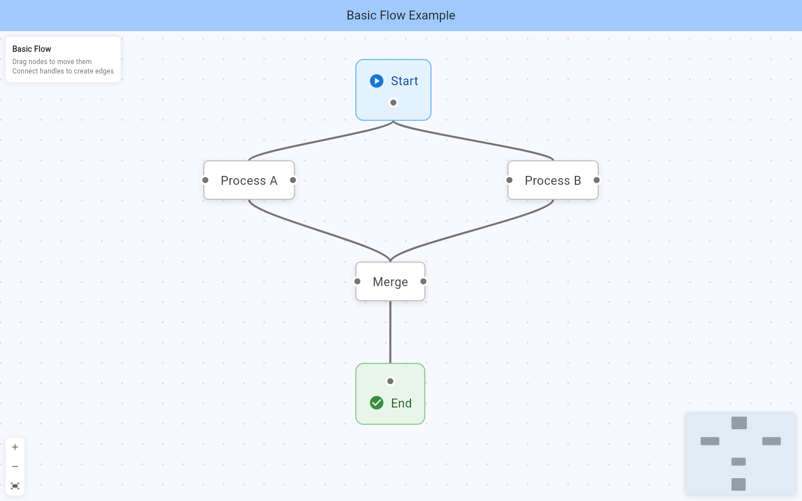
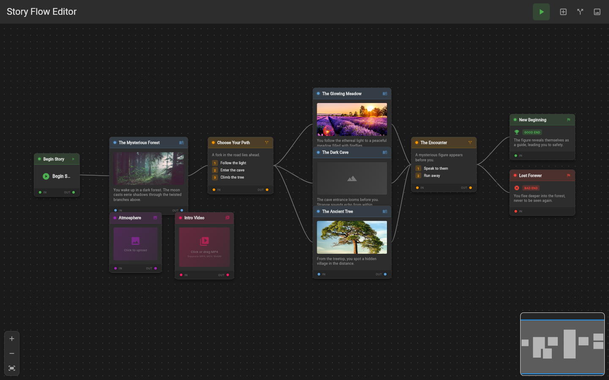
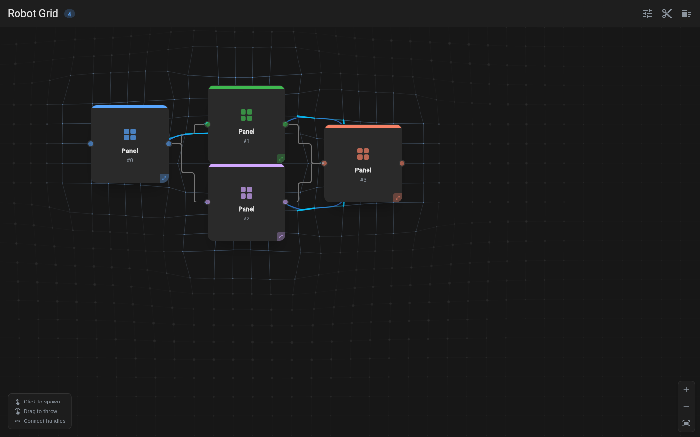
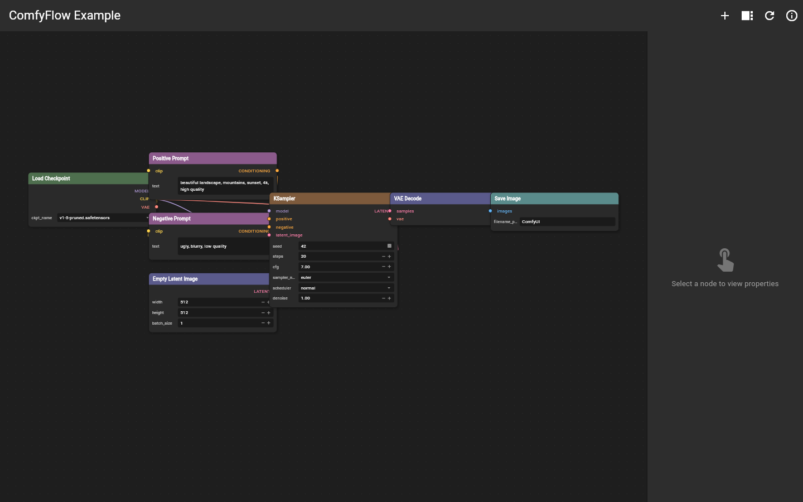
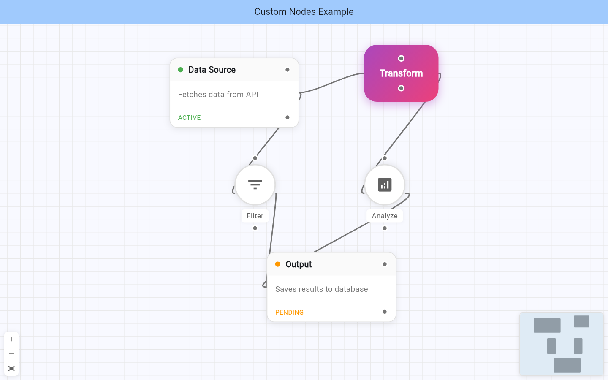
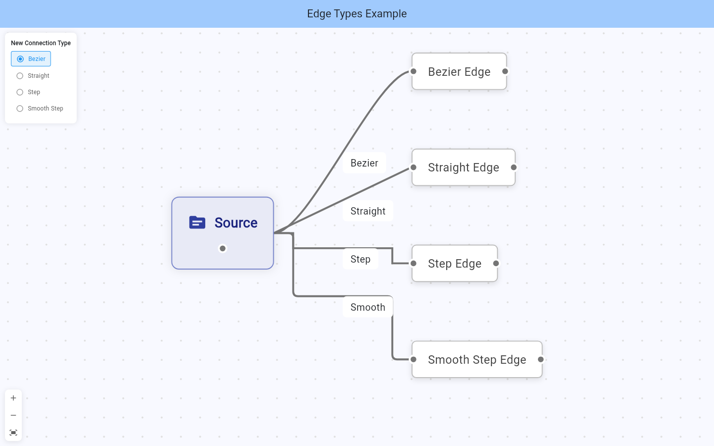

# xyflow_flutter

A Flutter port of [xyflow](https://xyflow.com) for building node-based editors, interactive diagrams, and workflow UIs.

Ready out-of-the-box and infinitely customizable — the same idea as [React Flow](https://reactflow.dev) and [Svelte Flow](https://svelteflow.dev), for Flutter.

## Examples

| Basic Flow | Story Flow |
| --- | --- |
|  |  |
| **Robot Grid** | **ComfyUI Flow** |
|  |  |
| **Custom Nodes** | **Edge Types** |
|  |  |

Run the gallery:

```sh
cd packages/xyflow_flutter/example
flutter run -d chrome
```

On web, jump straight to an example with `?example=basic` (`drag`, `custom`, `edges`, `story`, `connector`, `advanced`, `robot`, `comfyui`).

## Installation

```yaml
dependencies:
  xyflow_flutter:
    path: ../xyflow_flutter
```

## Basic usage

```dart
import 'package:flutter/material.dart';
import 'package:xyflow_flutter/xyflow_flutter.dart';

class FlowPage extends StatefulWidget {
  const FlowPage({super.key});

  @override
  State<FlowPage> createState() => _FlowPageState();
}

class _FlowPageState extends State<FlowPage> {
  var nodes = [
    Node(id: '1', position: XYPosition(x: 0, y: 0), data: {'label': '1'}),
    Node(id: '2', position: XYPosition(x: 0, y: 100), data: {'label': '2'}),
  ];
  var edges = [Edge(id: 'e1-2', source: '1', target: '2')];

  @override
  Widget build(BuildContext context) {
    return XYFlow(
      nodes: nodes,
      edges: edges,
      onNodesChange: (changes) => setState(() {
        nodes = applyNodeChanges(changes, nodes);
      }),
      onEdgesChange: (changes) => setState(() {
        edges = applyEdgeChanges(changes, edges);
      }),
      children: const [
        Background(),
        Controls(),
        MiniMap(),
      ],
    );
  }
}
```

## Features

- Pan, zoom, selection, and keyboard shortcuts
- Custom node and edge widgets
- Bezier, step, smooth-step, and straight edges
- Connection dragging from handles
- Background, Controls, MiniMap, Panel
- Undo/redo and clipboard helpers
- ComfyUI-style example with typed slots
